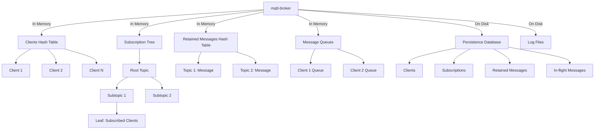

# mqtt-broker

A MQTT server that intends to eventually be [MQTT v5](https://docs.oasis-open.org/mqtt/mqtt/v5.0/mqtt-v5.0.html) and [v3.1.1](https://docs.oasis-open.org/mqtt/mqtt/v3.1.1/os/mqtt-v3.1.1-os.html) spec compliant.

This project is very early stages as I am learning Zig and practicing system programming, with a focus on safety. Thus, code is not well organized, is hacky, and is deep in the bootstrap stages!

## Testing

### Safety

Use the included `valgrind.sh` script to check for memory leaks. This requires that [valgrind](https://valgrind.org/) is installed.

### Features

It's recommended to use [MQTT Explorer](https://mqtt-explorer.com/) for testing features maually.

For protocol testing, it's convenient to use the [MQTT CLI](https://hivemq.github.io/mqtt-cli/), a full MQTT 5.0 and MQTT 3.1.1 compatible command line interface for MQTT clients.

```bash
zig build run

# in another terminal
mqtt test -V 5
```

## Planned Design

Most of these are TODO:

* Clients
  * Assigned a number on connection and is stored in a `AutoHashMap`.
  * Contains information such as connection status, will message, and a list of subscriptions.
* Subscriptions
  * Organized in a tree-like structure called a "subscription tree" or "topic tree".
  * Each node in the tree represents a topic level, with leaves containing lists of subscribed clients for efficient matching of published messages to subscribed clients.
* Retained Messages
  * Retained messages are stored in a separate hash table, keyed by their topics.
* Message Queue
  * For QoS 1 and 2 messages an in-memory queue is used for each client to handle message delivery and ack's.
* Other things
  * Proper event loop for handling clients instead of spawning threads.
  * A configuration file and command line flags.
  * Log to a configurable logfile.
  * Persist data to disk for durability: client subscriptions, retained messages, in-flight messages, etc.
  * Use [io_uring](https://unixism.net/loti/what_is_io_uring.html) for handling packet reads and writes.
  * Cluster support using state machine replication (SMR).

### Additional safety plans

* Explicit error handling everywhere, with asserts at both the caller, and inside the callpoint.
* Stronger integration tests with simulations or smoketests.
* Formal verification, if possible.

### High Level Design


